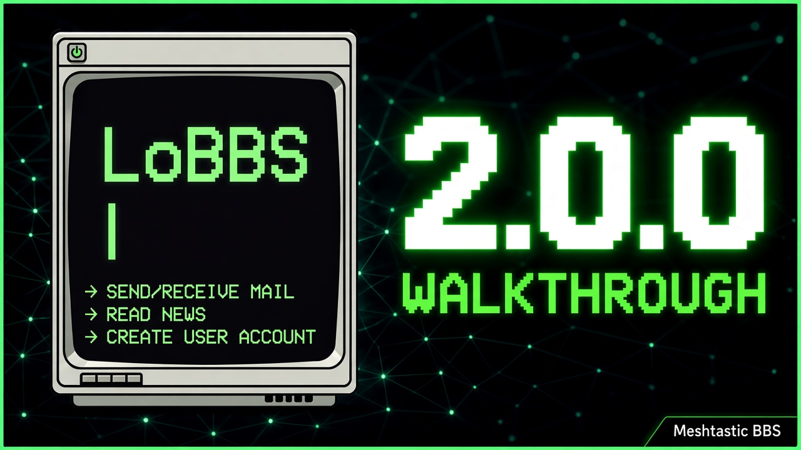

# LoBBS - Firmware-based BBS for Meshtastic

**A 100% Meshtastic BBS. No sidecar, no Python, just mesh**

---

### Watch the Walkthrough

[](https://youtu.be/lMK1zx9DbOI)

---

[Discord](https://discord.gg/DMrGcGQfMN)

## Features

- **User directory**
- **Private mail**
- **News feed**
- **Shared ASCII art wall**
- **Collaborative stories**
- CLI over DM

## Installation

[Install on MeshForge](https://meshforge.org/MeshEnvy/lobbs-meshtastic-firmware) or compile and flash from source.

Demo builds: add `-D LOBBS_DEMO_MODE` to `build_flags` (or `PLATFORMIO_BUILD_FLAGS="-D LOBBS_DEMO_MODE" pio run -e <env>`) to wipe `/flash/lodb/lobbs` on every boot and seed demo data. Accounts: `sysop` and `demo01` through `demo12`, password `demo1`. Sample mail, news, wall paint, and yarn text are included for paging tests.

### First-time install (SysOp)

A new LoBBS node has no database until you install it. Only `/help` and `/install` work until then. The install hint lists mounts that are present on this hardware (`flash`, plus `sd` when a card is present and `extra` on builds with `LOBBS_EXTRA_QSPI=1`).

`/install <flash|extra|sd> <user> <pass>` creates the database on that mount and makes `<user>` the SysOp. Use it from the local client (phone app connected over serial/BLE) or from a remote DM encrypted with a configured admin key. If the target already holds a LoBBS database, the same command adopts it and you must supply an existing SysOp username and password.

The choice is stored in `/flash/lobbs.ls`. If that mount is missing on a later boot, every command fails with an offline message until the hardware is fixed or you delete the marker and reinstall.

## How to use LoBBS

DM the node a line that starts with `/`. Module layout, developer docs, changelog, and host tools: [src/modules/LoBBS/README.md](src/modules/LoBBS/README.md).

`/login username password` signs in or creates a normal account after install. SysOp accounts are created only by `/install`.

Long replies are cached on the node for your session (about five minutes). Run the list command once, then `/p2`, `/p3`, and so on for the next pages. A new command replaces the cache. Machine clients use the same pattern with a fresh message id per page (`/43 p2`).

### Public

| Command         | Notes                                    |
| --------------- | ---------------------------------------- |
| `/hi`           | Same command catalog as `/help`          |
| `/status`       | Display overall status (paged)           |
| `/time`         | Current time                             |
| `/help [topic]` | Commands available to you, or topic help |
| `/pN`           | Next page of the last reply (e.g. `/p2`) |
| `/wall`         | Play the Wall game (shared ASCII art)    |
| `/yarn`         | Play the Yarn game (shared story)        |

### Session

| Command                | Notes                        |
| ---------------------- | ---------------------------- |
| `/login user password` | Sign in or create an account |
| `/logout`              | End session                  |
| `/whoami`              | Who you are                  |
| `/passwd new confirm`  | Change your password         |

### Users

Login required.

| Command            | Notes                   |
| ------------------ | ----------------------- |
| `/users list`      | User list (use `/p2` …) |
| `/users find text` | Search usernames        |

### Mail

Login required. SysOps reading someone else's inbox: [SysOp commands](#sysop-commands).

| Command                    | Notes                  |
| -------------------------- | ---------------------- |
| `/mail list`               | Your inbox             |
| `/mail read N`             | Read message N         |
| `/mail N`                  | Same as `/mail read N` |
| `/mail unread N`           | Mark unread            |
| `/mail delete N`           | Delete from your inbox |
| `/mail send user message…` | Send mail              |

### News

Login required.

| Command               | Notes                  |
| --------------------- | ---------------------- |
| `/news list`          | News index             |
| `/news read N`        | Read item N            |
| `/news N`             | Same as `/news read N` |
| `/news unread N`      | Mark unread            |
| `/news post message…` | Post news              |

### Wall

`/wall` shows the grid (no login). Painting needs login.

Rows `a`–`l`, columns `1`–`12`. `a4x` paints `x` at row a, column 4. `-a4` clears that cell. Several tokens in one command: `/wall a1# a2# b2#`.

| Command        | Notes                                   |
| -------------- | --------------------------------------- |
| `/wall token…` | Paint. Default quota is 1 cell per hour |

### Yarn

`/yarn` shows the tail (no login). Adding words needs login.

| Command        | Notes                                                       |
| -------------- | ----------------------------------------------------------- |
| `/yarn word …` | Add words. Default quota is 1 word (32 characters) per hour |

## SysOp commands

SysOp-only lines reply `SysOp only.` to everyone else.

| Command                       | Notes                                                                                          |
| ----------------------------- | ---------------------------------------------------------------------------------------------- |
| `/install flash user pass`    | First-time setup (see [First-time install](#first-time-install-sysop)); blank node only        |
| ----------------------------- | ---------------------------------------------------------------------------------------------- |
| `/passwd user new confirm`    | Reset a user's password                                                                        |
| `/users kick user`            | Log that user out                                                                              |
| `/users promote user`         | Make them a SysOp                                                                              |
| `/users demote user`          | Remove SysOp (not the last SysOp)                                                              |
| `/mail list user`             | Their inbox                                                                                    |
| `/mail read user N`           | Read their message (does not mark it read)                                                     |
| `/news delete N`              | Delete a news item                                                                             |
| `/wall limit SEC CELLS`       | Paint quota (default 3600 seconds, 1 cell)                                                     |
| `/yarn limit SEC WORDS CHARS` | Yarn quota (default 3600 seconds, 1 word, 32 characters)                                       |
| `/time unix`                  | Set the clock. The time must be after this firmware was built, or the reply is `Invalid time.` |
| `/cd [path]`                  | Set your working directory (default `/`). Each session keeps its own                           |
| `/pwd`                        | Show your working directory                                                                    |
| `/ls [path]`                  | List a directory, default the working directory (`*` glob on the last name only)               |
| `/cat path`                   | Read a file as text                                                                            |
| `/hex path`                   | Hex dump a file                                                                                |
| `/rm /path`                   | Delete a file (absolute path only)                                                             |
| `/rmdir /path`                | Remove an empty directory (absolute path only)                                                 |
| `/rmtree /path /path`         | Recursive delete (absolute path, typed twice)                                                  |
| `/mkdir path`                 | Create a directory under a mount (`/flash/...`, etc.)                                          |
| `/cp src dst`                 | Copy a file (no overwrite; directories refused)                                                |
| `/mv src dst`                 | Rename on one mount, or copy then delete across mounts (files only)                            |
| `/upload path [offset:b62]`   | Chunked file write at byte offset, or show current size                                        |
| `/commit src dst`             | Move when file CRC32 matches the 8-hex segment in the source name                              |
| `/stat path`                  | `file N` or `dir`                                                                              |
| `/df`                         | Used/total KB per mount (`?` when unknown)                                                     |

Paths use mount prefixes: `/flash/...`, `/sd/...`, `/extra/...` on builds with `LOBBS_EXTRA_QSPI=1` and a QSPI flash chip. `/` lists mounts. Do not `/rmtree` `/flash/lodb` unless you intend to wipe the BBS.

For larger files over mesh, see [chunked upload](src/modules/LoBBS/README.md#host-tools) in the LoBBS module README.

SysOps painting the wall or adding yarn do not use quota.

## Machine interface (message IDs)

Put a number and a space after `/` on a command to get a machine reply. The reply header echoes the id of the request it answers. Run the command first, then request further pages without re-running it.

```
/42 mail list
<42>ok [1:2]
…payload…

/43 p2
<43>ok [2:2]
…payload…
```

A reply that fits in one DM is `<id>ok`. Multi-page replies add `[n:max]` after `ok`. Success bodies start with `ok` and LoScalar record lines. Errors are `<id>` and one sentence with no `ok`. Without a leading id, replies use the human paginator and `{p i/n}` footers.

Human paging: `/p2` after `/mail list`. Machine paging: `/43 p2` (new id each page). The cache expires after about five minutes of idle time. Payloads larger than 8 KiB are not cached (page 1 only).

The 200-byte limit applies to each DM, including the `<id>ok [n:max]` header.

## Versions

- **Meshtastic base** — `[VERSION]` in `version.properties` (same as upstream: `APP_VERSION` in the phone app, e.g. `2.7.26.<git sha>`).
- **LoBBS** — `[LOBBS]` in `version.properties`; help text shows `LoBBS v` plus the short semver (e.g. `2.0.0`). Product history: [src/modules/LoBBS/CHANGELOG.md](src/modules/LoBBS/CHANGELOG.md). Bump LoBBS build with `python bin/bump_lobbs_version.py` (Meshtastic build: `bin/bump_version.py`).

### Release tags (source only)

LoBBS cuts annotated git tags on branch `lobbs` (no `v` prefix, no firmware binaries in the tag itself):

`lobbs-{lobbsSemVer}.{lobbsSha7}-meshtastic-{mtSemVer}.{mtSha7}`

Example: `lobbs-1.3.0.f18d6d6-meshtastic-2.7.26.54e0d8d`. The trailing Meshtastic sha is the upstream pin for that release line (default `54e0d8d` for 2.7.26). Preview or create a tag with `bin/lobbs-release-tag.sh` (dry-run) or `bin/lobbs-release-tag.sh --create`. Use `--lobbs-version` when tagging a commit that predates the `[LOBBS]` section in `version.properties`.

## License

LoBBS (the BBS) is [MIT](https://opensource.org/license/mit). Meshtastic firmware in this tree is [GPL v3](LICENSE).

## Disclaimer

LoBBS and MeshForge are independent projects not endorsed by or affiliated with the Meshtastic organization.

---

<div align="center" markdown="1">


<h1>Meshtastic Firmware</h1>


[](https://github.com/meshtastic/firmware/actions/workflows/ci.yml)
[](https://cla-assistant.io/meshtastic/firmware)
[](https://opencollective.com/meshtastic/)
[](https://vercel.com?utm_source=meshtastic&utm_campaign=oss)

<a href="https://trendshift.io/repositories/5524" target="_blank"></a>

</div>

</div>

<div align="center">
	<a href="https://meshtastic.org">Website</a>
	-
	<a href="https://meshtastic.org/docs/">Documentation</a>
</div>

## Overview

This repository contains the official device firmware for Meshtastic, an open-source LoRa mesh networking project designed for long-range, low-power communication without relying on internet or cellular infrastructure. The firmware supports various hardware platforms, including ESP32, nRF52, RP2040/RP2350, and Linux-based devices.

Meshtastic enables text messaging, location sharing, and telemetry over a decentralized mesh network, making it ideal for outdoor adventures, emergency preparedness, and remote operations.

### Get Started

- 🔧 **[Building Instructions](https://meshtastic.org/docs/development/firmware/build)** – Learn how to compile the firmware from source.
- ⚡ **[Flashing Instructions](https://meshtastic.org/docs/getting-started/flashing-firmware/)** – Install or update the firmware on your device.

Join our community and help improve Meshtastic! 🚀

## Stats


